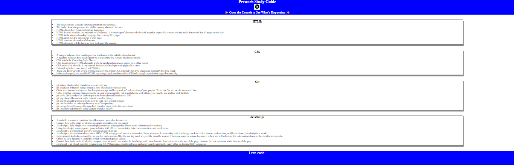

# Prework Study Guide Webpage

## 📌 Description
The Prework Study Guide is a resource designed for boot camp students to help them review key concepts from their prework. It provides organized notes on HTML, CSS, Git, and JavaScript to support learning and preparation.

## 🛠 Prerequisites
No prerequisites are needed—this study guide is designed for beginners.

## 📋 Criteria
This Prework Study Guide meets the following criteria:
* Provides clear and concise notes on HTML, CSS, Git, and JavaScript.

* Organizes content in an easy-to-navigate structure.

* Includes interactive study recommendations via Chrome DevTools.

* Requires no installation for accessibility and ease of use.

* Offers a visually appealing and user-friendly design.

## 💻 Technologies Used
This project was built using:
* HTML
* CSS
* JavaScript

## 🚀 Installation
No installation required—just open the webpage in your browser and start studying!

## 📚 Usage
To use this Prework Study Guide:
1. Review the notes in each section (HTML, CSS, Git, and JavaScript).

2. For study suggestions, open Chrome DevTools by pressing:
* Command + Option + I (macOS)
* Control + Shift + I (Windows)

3. The console will display a list of topics along with a suggestion on what to study first.

## 🔗 Live Demo & Repository
Application can be viewed here: 
* [Live](https://yvonnesarah.github.io/prework-study-guide/)

* [Repository](https://github.com/yvonnesarah/prework-study-guide)

## 🖼 Screenshot
Below is a preview of the Prework Study Guide Webpage:

## 👥 Credits
This project was created as part of a boot camp prework assignment.

## 📜 License
This project is open-source. For licensing details, please refer to the LICENSE file in the repository.

## 📬 Contact
You can reach me at 📧 yvonneadedeji.sarah@gmail.com.

